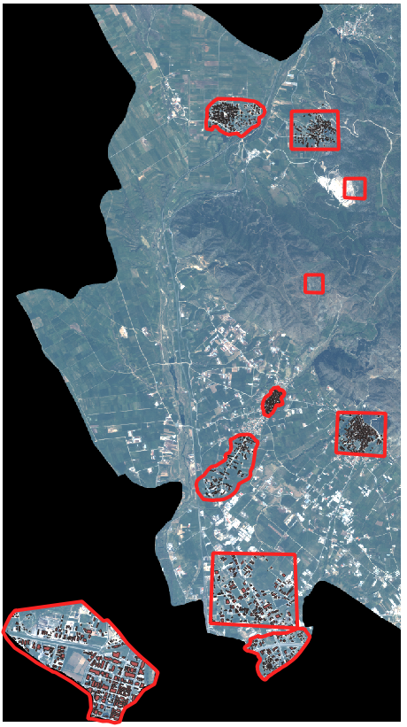

<!--  -->

<body>
    

        <h1 align='center'> A U-Net implementation for Building Segmentation on Ikonos-2 Satellite Images </h1>
        <h3 align='center'>(Work in Progress)</h3>
        

            Project based on the original <a href="https://arxiv.org/abs/1505.04597">U-Net paper</a>
            by Olaf Ronneberger, Philipp Fischer and Thomas Brox (2015)
        

    

    

        

            <h2>1. Data</h2>
            <ul>
                <li>Ikonos-2 Multispectral images consisted of a Blue, Green, Red, and Near-Infrared channel. Ikonos-2 images come at a Spatial Resolution of 0.8 meters and a Radiometric Resolution of 11 bits.</li>
                <li>Initial training phase includes samples from 10 sub-areas of an image of the greater Thessaloniki Region, Greece, taken in Spring. This phase aims to evaluate model performance overall, as well as its generalization capabilities on images acquired on different seasons, before the dataset can be expanded.  
                

                       &copy DigitalGlobe
                

                </li>
                <li>Sample areas were delineated in QGIS and samples were collected similarly from industrial and urban environments. Further samples were taken from irregular background areas. Extracted rasters were processed further into normalized tiles, separated in positive and negative samples and stored in hdf5 format. About 1/6 of each sub-area was kept for validation.</li>
                <li>Data was normalized to an [0. 1] interval prior to storage, divided by 2**11.</li>
            </ul>
            <footer align='center'><i>The images were purchased and provided by the Aristotle University of Thessaloniki.</i></footer>
        

        

            <h2>2. Training Environment</h2>
            

                
Training mainly followed the recommendations of Ronneberger et al. (2015).
                    Additional training ideas and methods, such as class balancing, were adopted from
                    <a href='https://www.google.com/search?channel=fs&client=ubuntu&q=deep+learning+with+pytorch'>Deep Learning with PyTorch</a> by Eli Stevens, Luca Antiga and Thomas Viehmann (2020).
                
 
                

                    
                

            

            <ul>
                <li><h4><b>Optimizer</b></h4>
                    Adam was used with a high momentum (beta1), as recommended in Ronneberger et al. 2015. Beta2 was kept at its default value.
                </li>
                <li><h4><b>Data Augmentation</b></h4>
                    Augmentation includes affine transformations (Translation, Rotation, Scaling and Shear), noise, brightness and contrast adjustments, as well as elastic deformations. Elastic deformation was implemented according to Microsoft paper <a href='https://www.microsoft.com/en-us/research/wp-content/uploads/2003/08/icdar03.pdf'>Best Practices for Convolutional Neural Networks Applied to Visual Document Analysis</a>. 
                    <ol>
                        <li>
                            <b>Translations</b> were implemented randomly up to 20% in either x and y axes.
                        </li>
                        <li>
                            <b>Rotation</b> was unrestricted up to 360 degrees.
                        </li>
                        <li>
                            <b>Scaling</b> was performed within 75-150% of the original scale.
                        </li>
                        <li>
                            <b>Shear</b> was applied randomly at a range of 70 degrees, using a single angular parameter in torchvision.transforms.functional.affine().
                        </li>
                        <li>
                            <b>Noise</b> robustness pursued was kept at 1%, but could generally be increased up to 2%.
                        </li>
                        <li>
                            <b>Contrast adjustment</b> was found to be particularly valuable in training for this particular task. Contrast was randomly adjusted between 50% and 200% of the original image, using a customised method to support 4-channel images. The images were re-normalized to [0, 1] post adjustment.
                        </li>
                        <li>
                            <b>Brightness adjustments</b> were applied within 50-150% of the original image brightness. Excessive pixel values were clipped to [0, 1] post adjustment.
                        </li>
                        <li>
                            <b>Elastic deformations</b> proved to be as crucial to training as claimed in the U-Net paper. However, the gaussian kernel used in the deformations has to be at least the same size as the kernel used for the convolutional neural networks, in order for the augmentation to be effective.
                        </li>
                    </ol>
                </li>
                <li>
                    <h4><b>Dropout Layers</b></h4>
                    Despite the extended augmentations, dropout layers were found to be necessary on some level for convolutional layers over 128 filters.
                </li>
                <li>
                    <h4><b>Usage</b></h4>
                    <pre><code>
model_training.py:

usage: Model Training [-h] [--epochs EPOCHS] [--batch-size BATCH_SIZE] [--num-workers NUM_WORKERS] [--lr LR] [--report] [--monitor] [--l2 L2   [L2 ...]] [--reload] [--init-scale INIT_SCALE] [--checkpoint CHECKPOINT] [--balance-ratio BALANCE_RATIO] [--report-rate REPORT_RATE] [--dropouts DROPOUTS [DROPOUTS ...]] [--weights WEIGHTS [WEIGHTS ...]] [--check-rate CHECK_RATE]

Training

optional arguments:
  -h, --help            show this help message and exit
  --epochs EPOCHS       Number of epochs for training
  --batch-size BATCH_SIZE
                        Batch size for training
  --num-workers NUM_WORKERS
                        Number of background processes for data loading
  --lr LR               Learning rate
  --report, -r          Store losses on memory and produce a report graph -- Contrained by memory size. Control with REPORT_RATE to minimize logs accordingly
  --monitor, -m         Observe activations and predictions of a sample
  --l2 L2 [L2 ...]      L2 Regularization parameters. Sequence of length 5. Applied like dropouts.
  --reload              Load checkpoint and continue training
  --init-scale INIT_SCALE, -i INIT_SCALE
                        The factor to initially multiply input channels with: in_channels*INIT_SCALE = out_channels -- Controls overall U-net feature length
  --checkpoint CHECKPOINT, -c CHECKPOINT
                        Path to saved checkpoint
  --balance-ratio BALANCE_RATIO, -b BALANCE_RATIO
                        Every n-th sample is negative, the rest are positive
  --report-rate REPORT_RATE
                        Epoch frequency to log losses for reporting. Default: EPOCHS // 10
  --dropouts DROPOUTS [DROPOUTS ...], -d DROPOUTS [DROPOUTS ...]
                        Sequence of length 5. Dropout probabilities for each NN block (positions 0-4). Applied symmetrically.
  --weights WEIGHTS [WEIGHTS ...], -w WEIGHTS [WEIGHTS ...]
                        Class weights for loss computation. Sequence of length <classes>
  --check-rate CHECK_RATE
                        Make checkpoint every n epochs - For Monitor/Checkpoint. Default: EPOCHS // 10
                    </code></pre>
                </li>
            </ul>
        

        

            <h2>3. Training Results
        

    

</body>
<footer>
Iosif Doundoulakis   M.Eng. Spatial Planning & Development 
iosif.doundoulakis@outlook.com
</footer>
