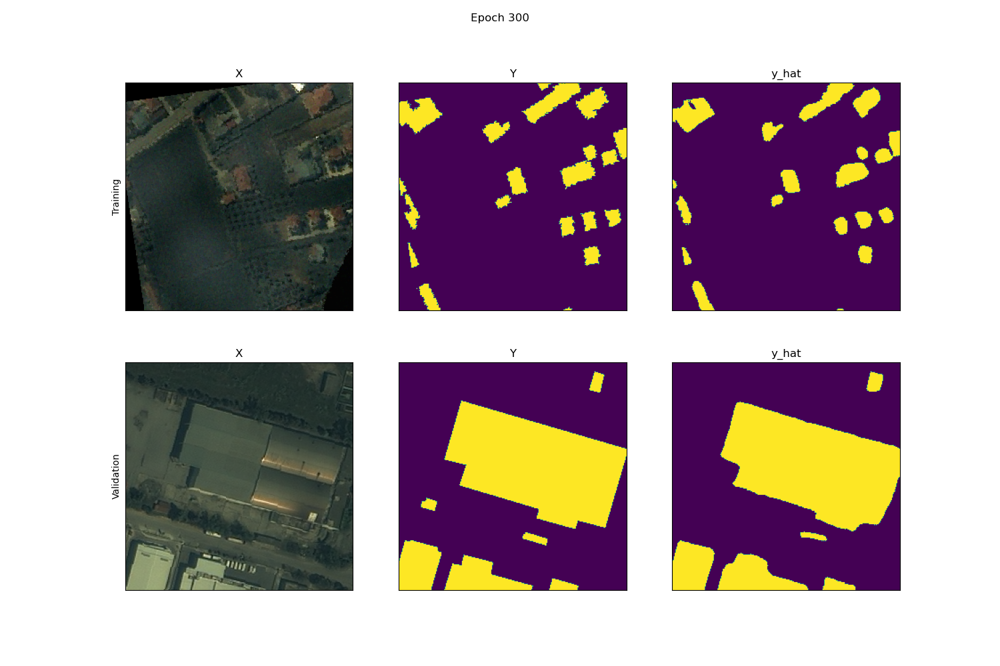
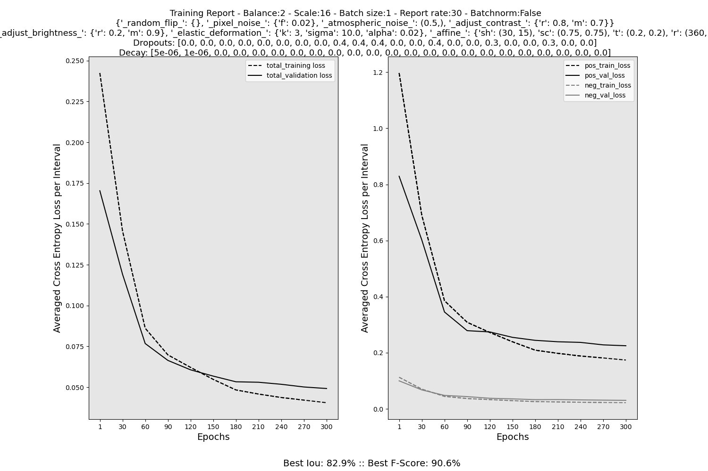
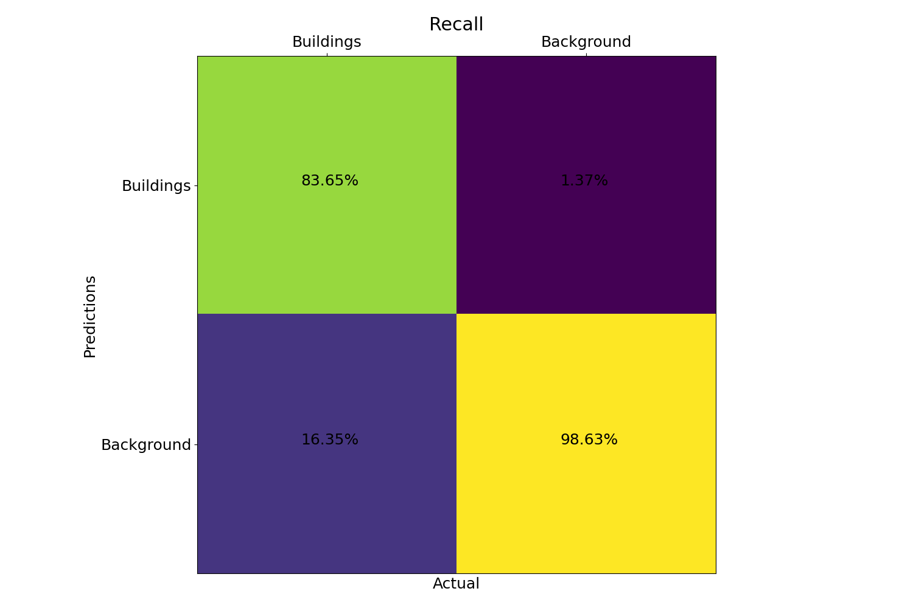
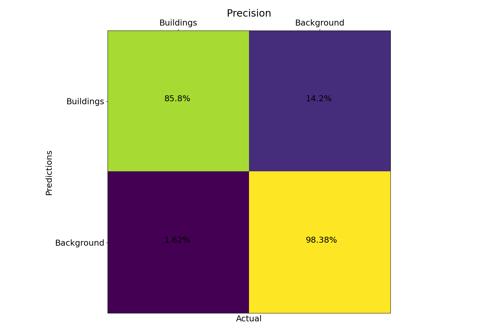
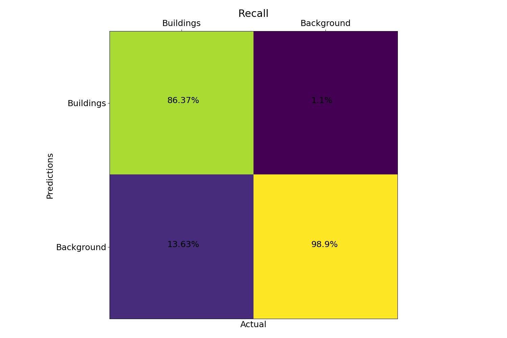
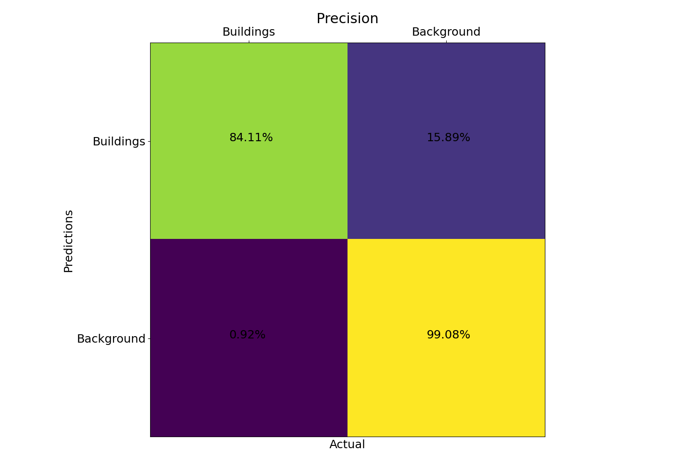
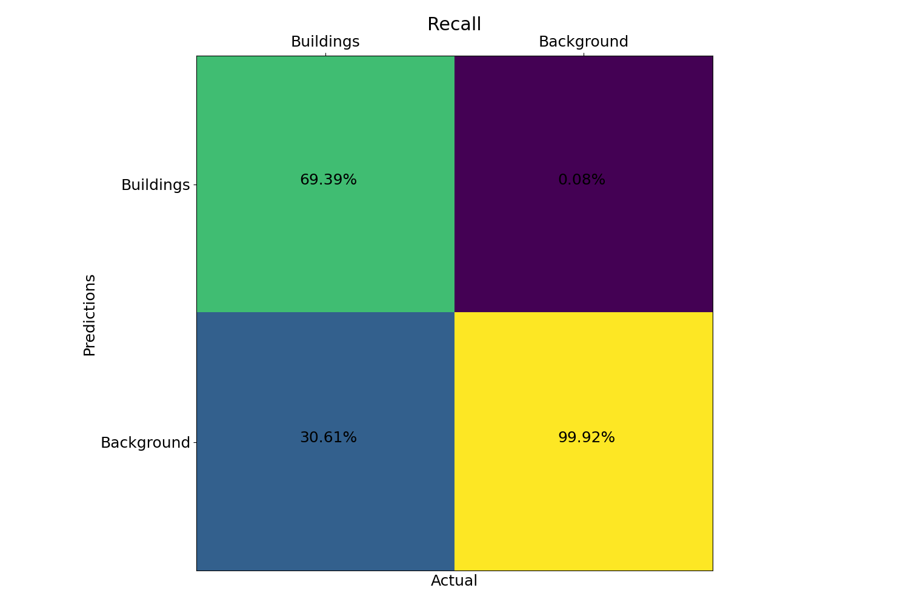
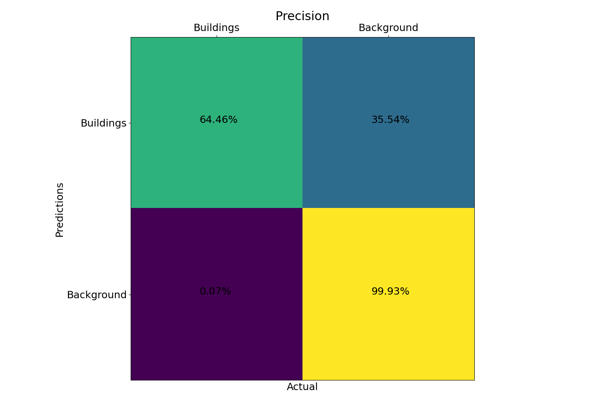

<!--  -->

<body>
    

        <h1 align='center'> A U-Net implementation for Building Segmentation on Ikonos-2 Satellite Images </h1>
        <h3 align='center'>(First version -- Will be pursued further if found useful)</h3>
        

            Project based on the original <a href="https://arxiv.org/abs/1505.04597">U-Net paper</a>
            by Olaf Ronneberger, Philipp Fischer and Thomas Brox (2015)
        

    

    
<i><b>Motivation:</b> Data availability & exploration of model capabilities -- Curiosity. The possibility of developing a quick and consistent building analysis tool for legacy Ikonos-2 archives.</i>
    

    

        

            <h2>1. Data</h2>
            <ul>
                <li>Ikonos-2 Multispectral images are consisted of a Blue, Green, Red, and Near-Infrared channel. Ikonos-2 images come at a Spatial Resolution of 0.8 meters and a Radiometric Resolution of 11 bits.</li>
                <li>Initial training phase includes samples from 10 sub-areas of an image taken at the greater Thessaloniki Region, Greece, taken in Spring. This phase aims to give initial performance evaluations and generalization capabilities on images of different distributions (e.g. acquired in other seasons), before the dataset distribution can be expanded.  
                

                     
                    <footer>Training areas Image: &copy; DigitalGlobe, edited </footer>
                

                </li>
                <li>Sample areas were delineated in QGIS and samples were collected similarly from industrial and urban environments. Further samples were taken from irregular background areas. Extracted rasters were processed further into normalized tiles, separated in positive and negative samples and stored in hdf5 format. About 1/6 of each sub-area was kept for validation.</li>
                <li>Data was normalized to an [0. 1] interval prior to storage, divided by 2**11.</li>
            </ul>
            <footer align='center'><i>The images were purchased and provided by the Aristotle University of Thessaloniki.</i></footer>
        

        

            <h2>2. Training Environment</h2>
            

                
Training mainly followed the recommendations of Ronneberger et al. (2015), <u>without applying additional weights to edge pixels</u> as suggested in the paper.
                    Additional training ideas and methods, such as class balancing, were adopted from
                    <a href='https://www.google.com/search?channel=fs&client=ubuntu&q=deep+learning+with+pytorch'>Deep Learning with PyTorch</a> by Eli Stevens, Luca Antiga and Thomas Viehmann (2020).
                
 
                

                    
                

            

            <ul>
                <li><h4><b>Optimizer</b></h4>
                    Adam was used with a high momentum (beta1), as recommended in Ronneberger et al. 2015. Beta2 was kept at its default value.
                </li>
                <li><h4><b>Class Balancing</b></h4>
                A tile size of 256 * 256 was chosen, since it was found to produce cleaner samples and allowed for a better separation of tiles into negative (label 0) and positive (label 1).
                </li>
                <li><h4><b>Data Augmentation</b></h4>
                    Augmentation includes affine transformations (Translation, Rotation, Scaling and Shear), noise, brightness and contrast adjustment, as well as elastic deformation. Elastic deformation was implemented according to Microsoft paper <a href='https://www.microsoft.com/en-us/research/wp-content/uploads/2003/08/icdar03.pdf'>Best Practices for Convolutional Neural Networks Applied to Visual Document Analysis</a>. 
                    <ol>
                        <li>
                            <b>Translations</b> were implemented randomly up to 20% in both x and y axes.
                        </li>
                        <li>
                            <b>Rotation</b> was unrestricted up to 360 degrees.
                        </li>
                        <li>
                            <b>Scaling</b> was performed within 75-150% of the original scale.
                        </li>
                        <li>
                            <b>Shear</b> was applied randomly at a range of 70 degrees, using a single angular parameter in torchvision.transforms.functional.affine().
                        </li>
                        <li>
                            <b>Pixel Noise</b> was applied in a normal distribution of Standard Deviation 0.02.
                        </li>
                        <li>
                            <b>Atmospheric Noise</b> was applied from a mask of size 32 x 32 and Std 0.5, upsampled to tile dimensions. This augmentation attempts to simulate the effects of haze and absorption.
                        </li>
                        <li>
                            <b>Contrast adjustment</b> was found to be particularly valuable in training for this particular task. Contrast was randomly adjusted between 70% and 150% of the original image, using a customised torchvision method to support 4-channel images. The images were re-normalized to [0, 1] post adjustment.
                        </li>
                        <li>
                            <b>Brightness adjustments</b> were applied within 80-120% of the original image brightness. Excessive pixel values were clipped to [0, 1] post adjustment.
                        </li>
                        <li>
                            <b>Elastic deformations</b> proved to be as helpful in training as claimed in the U-Net paper. The gaussian kernel used in the deformations appears to have to be the same size as the kernel used for the convolutional neural networks, for optimal results.
                        </li>
                        

                            
                            <footer>Examples of augmented training sample and validation sample at 300th epoch.</footer>
                        

                    </ol>
                </li>
                <li>
                    <h4><b>Regularization</b></h4>
                    <ul>
                    <li>
                        

                            <b>Weight Decay:</b> L2 regularization was applied to the first two convolutional layers, due to excessive growth of single filters. This is assumed to be occuring due to the NIR input channel, which can be exploited to explain the majority of negative samples.
                        

                    </li>
                    <li>
                        

                            <b>Dropout Layers</b>
                            Two dropout layers were applied in the last downsampling block as suggested in literature. However, despite the extent of augmentations the model kept overfitting, so additional layers were added in each residual conjunction with a droprate of 30%.
                        

                         
                        --
                         
                        <i>Still experimenting from time to time, <b>might not</b> be in line with current model.</i>
                         
                        --
                    </li>
                    </ul>
                </li>
                <li>
                    <h4><b>Latest Successful Architecture+Tuning</b></h4>
                    

                        
                        <footer>Source: <i>Ronneberger et al. (2015) -- Edited by author</i></footer>
                    

                </li>
                <li>
                    <h4><b>Training Environment Usage</b></h4>
                    
<i>Incase anyone is interested in training further</i>

                    <pre><code>
model_training.py:

usage: Model Training [-h] [--epochs EPOCHS] [--batch-size BATCH_SIZE] [--num-workers NUM_WORKERS] [--lr LR] [--report] [--monitor] [--l2 L2 [L2 ...]] [--reload]
                      [--init-scale INIT_SCALE] [--checkpoint CHECKPOINT] [--balance-ratio BALANCE_RATIO] [--report-rate REPORT_RATE] [--dropouts DROPOUTS [DROPOUTS ...]]
                      [--weights WEIGHTS [WEIGHTS ...]] [--check-rate CHECK_RATE]

Training

optional arguments:
  -h, --help            show this help message and exit
  --epochs EPOCHS       Number of epochs for training
  --batch-size BATCH_SIZE
                        Batch size for training
  --num-workers NUM_WORKERS
                        Number of background processes for data loading
  --lr LR               Learning rate
  --report, -r          Store losses on memory and produce a report graph -- Contrained by memory size. Control with REPORT_RATE to minimize logs accordingly
  --monitor, -m         Observe activations and predictions of a sample
  --l2 L2 [L2 ...]      L2 Regularization parameters. Sequence of length 23.
  --reload              Load checkpoint and continue training
  --init-scale INIT_SCALE, -i INIT_SCALE
                        The factor to initially multiply input channels with: in_channels*INIT_SCALE = out_channels -- Controls overall U-net feature length
  --checkpoint CHECKPOINT, -c CHECKPOINT
                        Path to saved checkpoint
  --balance-ratio BALANCE_RATIO, -b BALANCE_RATIO
                        For positive values roughly every n-th sample is negative, the rest are positive. The opposite for negative values.
  --report-rate REPORT_RATE
                        Epoch frequency to log losses for reporting. Default: EPOCHS // 10
  --dropouts DROPOUTS [DROPOUTS ...], -d DROPOUTS [DROPOUTS ...]
                        Sequence of length 23. Dropout probabilities for each CNN.
  --weights WEIGHTS [WEIGHTS ...], -w WEIGHTS [WEIGHTS ...]
                        Class weights for loss computation. Sequence of length 2
  --check-rate CHECK_RATE
                        Write checkpoint every n epochs - For Monitor/Checkpoint options. Default: EPOCHS // 10
                    </code></pre>
                </li>
            </ul>
        

        

            <h2>3. Training Results</h2>
                    

                         
                        <footer>Latest Successful Experiment -- Model training visualization</footer>
                    

            </ul>
        

        

            <h2>4. Test Results</h2>
            <ol>
            <li>
            <h4><b>Same Distribution</b> <i>(Neighboring spring scene)</i></h4>
            

            Testing samples were drawn from a neighboring scene to the training distribution, taken the same day.
            

            

                 
                <footer>Test areas, Image: &copy; DigitalGlobe, edited </footer>
            

                <ul>
                    <li>
                    Urban:
                    

                    
                    
                    

                    </li>
                    <li>
                    Industrial:
                    

                    
                    
                    

                    </li>
                    <li>
                    Mostly Background -- Elevated Areas:
                    

                    
                    
                    

                    </li>
                </ul>
            </li>
            <li>
            <h4><b>Different Distribution</b> <i>(Further away winter scene)</i></h4>
            

            # TODO
            

            </li>
            </ol>
        

        

        <h2>5. Brief Error Inspection</h2>
        
Cement rooftops appear to be under represented.

        # TODO
        

    

</body>
<footer>
<h4><u><b>Developer/Author</b></u>:</h4>
Iosif Doundoulakis   M.Eng. Spatial Planning & Development 
iosif.doundoulakis@outlook.com
</footer>
